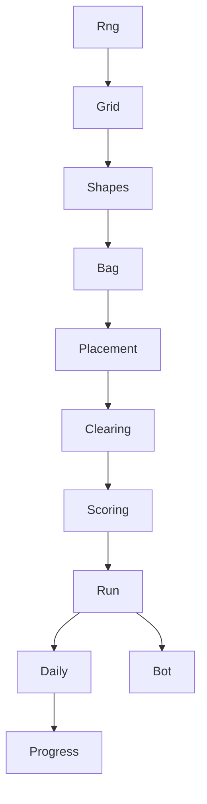

# Block Puzzle Game

Sep 25, 2026 · @Rex

## Premise

A drag-and-place block puzzle in the Block Blast and Woodoku family, in pixel art, shipped first in a series of retro games so the store, ads, consent and save pipeline gets built and learned on the smallest possible game. The Candy Crush Game doc holds the second title and reuses everything built here.

Why this ships first:

- **Least logic of any genre that earns.** Place, check lines, clear. No cascade, no specials, no levels to tune.
- **No content pipeline.** Shapes come from a random bag, so there is nothing to author after the shape list.
- **Currently top of the ads-only casual charts**, which means the audience is proven and the monetization shape is known.
- **Native to pixel art.** Blocks were pixels to begin with.

Income comes from rewarded ads and interstitials on web portals and Android, plus one remove-ads purchase. The genre is saturated, so the realistic goal is a small, steady earner and a working pipeline, not a hit. The daily challenge and streak are what bring players back, and the shape bag's hidden mercy is what keeps them from quitting on a bad draw.

## Core mechanic

The loop is fixed across the genre and is the spec. The engine implements these ordered rules and nothing else.

1. The grid starts empty. Nothing falls and nothing moves on its own.
2. The player is handed three shapes drawn from the bag.
3. The player drags a shape onto the grid. It may be placed anywhere every one of its cells is empty and inside the grid. No rotation.
4. On placement, every full row and every full column clears at once. In Woodoku mode, every full 3x3 box clears too.
5. Score: cells placed, plus a bonus per line cleared, plus a combo multiplier when several lines clear on one placement, plus a streak multiplier when consecutive placements each clear something.
6. When all three shapes are placed, three new ones are drawn.
7. Game over when none of the shapes in hand fits anywhere on the grid. A rewarded ad may clear a chosen row and column once per run to continue.

**The shape bag is the design.** Pure random draws kill players to bad luck and they quit. Every good entry in the genre biases the draw. UNVERIFIED numbers, to be tuned by the bot:

- Weighted bag: singles and small pieces weighted higher when the grid is above a fullness threshold.
- Mercy rule: if none of three random shapes would fit, redraw once with only shapes that fit. Never tell the player.
- Kill rule: after a long run, lower the mercy chance so runs end. The high score must be reachable but not infinite.

**Shape set.** 25 bag entries over 11 silhouettes, 1010!'s classic 19 plus T, S and Z as in Block Blast: single; 2, 3, 4 and 5 in a line, each both ways; 2x2; 3x3; small L in 4 rotations; large L in 4 rotations; T in 4 rotations; S and Z. Rotations are separate bag entries since the player cannot rotate. Data lives in the repo at data/shapes.json.

**Edge cases the engine settles before code.** A placement that fills a row and a column sharing a cell, the streak resetting on a placement that clears nothing, the fit check when the grid is nearly full, and whether the mercy redraw counts toward the draw seed.

## What we build

One endless mode at launch, a daily challenge, a high score, and pixel art on a locked palette. Everything else waits for the numbers.

| Decision | Recommendation | Status |
| --- | --- | --- |
| Grid | 8x8 | proposed |
| Hand size | 3 shapes | proposed |
| Rotation | none, rotations are separate bag entries | proposed |
| Box clears | off at launch, Woodoku-style 3x3 as a second mode later | proposed |
| Modes at launch | endless, daily challenge with a fixed seed shared by every player that day | proposed |
| Continue | one rewarded ad per run clears a chosen row and column | proposed |
| Theme | rune tablet in the dungeon world: plain stone tiles at launch, invented glyphs in version two | decided |
| Art style | pixel art, one locked palette, 24 px block, whole-number scaling, nearest-neighbor filtering | decided |
| Sound | one sting each for place, clear, combo, game over, plus a short loop | proposed |
| Launch content | shape list, palette, one grid skin, daily seed table, store listing | proposed |

**Feel is the product.** In this genre every competitor has the same rules, so the difference is the placement snap, the clear animation, the combo sound, and how the shape bag treats a struggling player. Budget polish time for those four things specifically.

**Pixel rules.** Block sprite at 24 px (decided; set by the per-cell glyph rule), grid drawn at a whole-number scale, effects as animated sprite sheets, no mixing pixel and smooth assets. Six-hue palette for the shapes is not required here since shapes are not matched by color, but coloring each shape type consistently helps players read the hand at a glance.

**Feel budget.** Six animations, six sounds, one block tile. This is the whole polish surface and where the game differs from every other clone.

| Animation | Sound |
| --- | --- |
| shape lifts and follows the finger | pick up |
| shape snaps into place | place |
| line clear flash, blocks pop | clear, pitched up per combo line |
| combo text pops | combo sting |
| board shakes and fades on game over | game over |
| calendar day stamps in | daily complete |

**Theme candidates.** Woodoku is wood, Block Blast is glossy plastic, 1010! is flat color. Ours has to belong to the retro series and sit beside the dungeon-crawl match-3.

| Theme | What the blocks are | What a clear is | Fits the series | Art cost | Uniqueness |
| --- | --- | --- | --- | --- | --- |
| Loot bag (inventory Tetris) | dungeon loot drawn on the cell grid: a spear is the 1x4, a shield the 2x2, a chest the 3x3, a bow the L, a hammer the T, a rope the S | a full row is packed and sold, coins clink | strongest: same dungeon world, and inventory-grid packing is a thing retro gamers already love | 19 item sprites plus the bag background | high, no block puzzle does this |
| Stone masonry | stone bricks | a wall section seals with a torch-lit flash | strong, dungeon walls | one tile, a few variants | medium |
| Rune tablet | carved rune blocks | a full line glows and fades into the stone | strong | one tile plus glow frames | medium |
| Cartography | map tiles | a full row is charted | fine | one tile plus a parchment board | medium |

**Chosen: rune tablet (Rex, 2026-09-25).** The board is a stone tablet, blocks are carved rune stones, a full line reads and glows, the tablet hums. Loot bag stays as the noted alternative.

Rules for the rune art:

- Invent the alphabet from Rex's rune research cache. One glyph per silhouette, not per rotation: eleven glyphs for single, domino, tromino line, tetromino line, pentomino line, 2x2, 3x3, small L, large L, T, S. The glyph rotates with the shape so the player learns the pair once.
- The glyph is drawn small on every cell of the shape, not spanning the shape, so a half-cleared shape still reads. This sets the block size at 24 px.
- No real Futhark letters, and never the runes co-opted by hate groups (Othala, doubled Sowilo, Tiwaz, Wolfsangel), so there is nothing to flag.
- No pentagrams, inverted crosses, summoning circles, sigils, goat heads, 666, blood, candles or altars. Fantasy magic only; target rating Everyone.
- The same glyph script appears on the match-3's spell scroll, so this game defines the series' rune font.
- No second puzzle layer at launch. A "rune words" scoring bonus (a set glyph sequence completed in one row pays extra) is the post-launch depth option; it is a scoring rule, not a new mechanic.

**Tile art direction (Rex, 2026-09-25): plain stone.** One 24 px tile, flat stone in two or three shades with a one-pixel darker edge, no texture detail. The glyph sits on top in a contrasting shade. States: resting, lit for the clear glow, and a ghost version for the placement preview. Board is the same stone, darker, with a faint grid. That is the entire tile set: one tile, three states, eleven glyphs.

**Version one ships without glyphs (Rex, 2026-09-25).** Plain stone tiles only; a shape is read by its outline, as in every other block puzzle. The eleven-glyph rune alphabet, per-cell drawing and the rune words bonus are all version two. The tile art rules above still apply.

## Monetization and retention

Ads only at launch, one remove-ads purchase, nothing else. All calls go through interfaces with fake implementations so the engine and tests never touch an SDK.

| Channel | What it does | When it fires | Launch blocker |
| --- | --- | --- | --- |
| Rewarded video | continue once per run by clearing a chosen row and column; double the daily reward | player opts in | yes |
| Interstitial | between runs | not on the first 3 runs, at most one per 2 runs | yes |
| Remove ads | one purchase, kills interstitials, keeps rewarded | store screen | yes |
| Portal revenue share | portal serves ads around the web build | portal SDK, web only | yes for web |

**Retention.** The genre runs on the loop itself, not a meta: short runs, a high score to beat, satisfying clears, and a daily hook. No building or decoration layer; that stays in the match-3. At launch: a daily puzzle calendar with one shared seed per day, and a monthly trophy for completing every day of the month (Woodoku's proven form), plus a local high score and a daily leaderboard if the portal offers one. A short level mode with goals like "clear 40 blocks" (Block Blast's Adventure) can follow launch if the numbers ask for it.

**Compliance, all launch blockers.** Privacy policy at a public URL, Google UMP consent flow for GDPR and US state laws, age gating or a child-directed declaration with no personalized ads, store listing assets.

**Analytics from day one.** Run start, run end with score and placements, continue offered, continue taken, ad shown, ad rewarded, purchase, daily played, session length. The shape bag gets tuned from run length and game-over distributions.

## Architecture

Same shape as Duelist and the match-3: a pure rules engine that emits an event log, a view that only animates that log, and CI that proves the engine has no renderer dependency. This project is where the `ops/` layer gets written for the first time; the match-3 inherits it.

```
data/            shapes.json (the bag with weights), palette.json, daily_seeds.json
engine/          Pure rules. No renderer import. Seeded RNG streams. Emits an event log.
engine.tests/    One test per rule. Runs headless in CI.
tools/sim/       Bot: plays N runs per bag config, reports run length and game-over distribution.
game/            View only. Animates the event log. Contains zero rules.
ops/             Ads, IAP, analytics, save, behind interfaces with fake implementations for tests.
```

**Hard constraints.**

- `engine/` imports nothing from the renderer. CI runs the tests with no renderer installed.
- Every state change emits exactly one event. The view never computes a rule; it asks the engine whether a shape fits.
- Every random draw uses a named, seeded stream: `Bag`, `Mercy`, `BotTieBreak`. The daily challenge is a fixed seed, so the same day is the same board for everyone.
- Adding a shape or changing a weight is a JSON edit.
- Ad, purchase, analytics and save calls go through interfaces. Tests use fakes.

**Event vocabulary (first draft).** `HandDrawn`, `PlacementRejected`, `Placed`, `LinesCleared`, `ComboScored`, `StreakChanged`, `HandEmpty`, `NoFitDetected`, `ContinueOffered`, `ContinueUsed`, `RunEnded`.

**Stack: TypeScript, PixiJS for the view, Vitest for tests, Capacitor for Android and iOS, plain web build for portals (decided 2026-09-25).** The game logic is small enough that the language does not matter; what matters is export, ad plugins and iteration speed. This stack keeps web open at no cost, has the best-maintained AdMob and billing plugins of the options, iterates in a browser refresh, and handles pixel art with one nearest-neighbor setting. Nothing from the Duelist codebase would have carried into this game, only its process, which is language-neutral. Godot C# stays the stack for the deckbuilder on the Duelist engine; the series runs two toolchains, each where it fits. The `ops/` layer written here is copied into the match-3.

## Modules

One module per session, in this order. A module may call anything above it and nothing below it.



| Module | Purpose | Public API | Must not | Tests |
| --- | --- | --- | --- | --- |
| Rng | named seeded streams | `stream(name).next(n)` | share sequence between streams | determinism, independence |
| Grid | cell occupancy, bounds | `isEmpty(pos)`, `set(pos)`, `clear(pos)`, `rows()`, `cols()` | know any rule | bounds, occupancy round trip |
| Shapes | load shape list from JSON | `all()`, `cells(shapeId)` | be mutated after load | every shape's cell count, rotations distinct |
| Bag | weighted draw, mercy and kill rules | `drawHand(state, rng)` | touch the grid except through Placement.fits | weights honored, mercy fires only when no fit, kill rule after threshold |
| Placement | fit check and placement | `fits(shape, origin, grid)`, `place(shape, origin, grid)` | score or clear | fit at edges, overlap rejected |
| Clearing | find and clear full rows and columns (and boxes in Woodoku mode) | `clear(grid)` returns lines cleared | score | shared cell cleared once, box mode toggle |
| Scoring | cells, line bonus, combo, streak | `score(placement, cleared, streak)` | mutate state | every term, streak reset |
| Run | the turn: place, clear, score, redraw, game over, continue | `start(seed)`, `place(shapeIndex, origin)`, `continueRun(row, col)`, `events()` | be called by the view for anything else | full run to game over under a seed, continue once |
| Daily | seed per calendar day, one attempt | `todaySeed()`, `attempted(day)` | compute a rule | seed stable across timezones by UTC day |
| Progress | high score, streak days, remove-ads flag, save and load | `record(run)`, `serialize()` | hold game logic | round trip |
| Bot | greedy player for tuning the bag | `play(seed, bagConfig)` returns placements, score | see the bag's next draw | run-length distribution report |

Each card gets the same fields as Duelist's MODULES.md before its session starts: Purpose, Public API, Reads, Writes, Must not, Invariants, Spec section, Tests, Context to load.

## Division of labor

Same split as Duelist and the match-3. Claude Code owns architecture and modules, Cursor Composer does mechanical batches from a written prompt with a test list, Rex decides and verifies.

| Who | Owns | Does not touch |
| --- | --- | --- |
| Rex | P0 decisions, theme and palette, pixel sprites and sound, store and ad accounts, playtesting, verifying recordings by opening the frames | engine internals |
| Claude Code | AGENTS.md, HANDOFF.md, MODULES.md, every engine module and its tests, the bag rules, the bot, CI, the ops interfaces and their fakes | sprites, sound |
| Cursor Composer | screen wiring, asset import, ad and IAP plugin plumbing from a written recipe, store listing copy drafts, daily seed table | engine rules, anything without a written prompt and test list |

Rules of engagement: one module or one feature per chat; no rule that is not in the Core mechanic section or the refinement log; a recording counts as verified only when the frames were opened; a change to Bag, Placement or Clearing must pass the whole run suite before it is done.

**Rex's task list.** Everything only Rex can do, in build order. Tick as done.

- [ ] Decide the P0 rows below: stack, name and theme, platform order, grid and box mode, repo.
- [ ] Lock the palette before any sprite is drawn.
- [ ] Pull eleven candidate glyphs from the rune research cache, redraw them as invented shapes on a 24 px cell, and check none resembles a real or co-opted rune.
- [ ] Plain stone tile at 24 px in three states (resting, lit, ghost), the eleven invented glyphs drawn per cell, and the darker board stone with its grid.
- [ ] Board background and hand tray.
- [ ] Six animations from the feel budget as sprite sheets.
- [ ] Six sounds from the feel budget, plus one short loop.
- [ ] Calendar screen art: empty day, completed day, monthly trophy.
- [ ] Google Play developer account, AdMob account, a hosted privacy policy URL.
- [ ] Portal account (Poki or CrazyGames) and their SDK key.
- [ ] Store listing: icon, screenshots, feature graphic, short and long description.
- [ ] Playtest a full run on device at step 5 and record it; verify by opening the frames.
- [ ] Playtest the daily puzzle on two devices at step 6.

## Build order with gates

Nothing in a later step starts until the earlier gate passes. Step 1 comes before any engine code because the export and ad plumbing is where solo projects die, and it is the whole reason this game ships first.

| Step | Work | Owner | Gate |
| --- | --- | --- | --- |
| 1 | Blank project, export pipeline, test rewarded ad | Claude Code scaffold, Composer plumbing | a build runs on Android and web and shows a test ad |
| 2 | Repo docs: AGENTS.md, HANDOFF.md, MODULES.md with contract cards, Cursor rules, CI | Claude Code | DONE 2026-09-25: repo github.com/Carlos-Roman-Conville/runestone, CI green, 20 tests, layer guard proven to fail on a bad import |
| 3 | Engine modules Rng through Run, headless | Claude Code | a scripted run plays to game over in a test under a fixed seed |
| 4 | Bot and bag tuning | Claude Code | run-length distribution inside the target band |
| 5 | View: grid, drag and snap, clear animation, hand, score | Composer wiring, Claude Code review | a human plays a full run on device |
| 6 | Daily challenge, progress and save, continue via rewarded ad | Claude Code engine, Composer screens | save survives a restart, daily seed matches across two devices |
| 7 | Ads, remove-ads purchase, analytics, consent, privacy policy | Composer plumbing from recipe, Rex accounts | real ads serve, consent passes, purchase completes in sandbox |
| 8 | Pixel art pass, sound, store assets, listing | Rex | listing approved |
| 9 | Soft launch on one portal and Android | Rex | analytics arriving |
| 10 | Live loop: retune the bag from run data, then decide on Woodoku mode | all | monthly |

## P0 decisions for Rex

These block the first line of code. Change the Status dropdown and write the decision in the last column; the refinement log records the why.

| # | Decision | Recommendation | Status | Decided |
| --- | --- | --- | --- | --- |
| 1 | Stack | TypeScript, PixiJS, Vitest, Capacitor; web build for portals | Decided | TypeScript stack. Duelist reuse was process only, so toolchain consistency carried no weight. |
| 2 | Game name and theme | retro; either the same dungeon world as the match-3 (stone bricks, torch-lit clears) or its own | Decided | Rune tablet, invented alphabet, same dungeon world as the match-3. Name still open. |
| 3 | Platform order | web portal and Android together at soft launch, iOS after revenue justifies the developer account | Open | pending |
| 4 | Grid and box mode | 8x8, box clears off at launch | Open | pending |
| 5 | Repo | fresh public-safe repo, private until the listing is live | Open | pending |
| 6 | Art style | pixel art, locked palette | Decided | Pixel art, decided with the series direction on 2026-09-25 |

## Refinement log

Every decision, ruling and open question lands here, newest first. A row marked UNVERIFIED is a best guess that code may rely on until it is settled.

| Date | Item | Decision or question | Tag |
| --- | --- | --- | --- |
| 2026-09-25 | Series order | This ships first, the match-3 second, a retro deckbuilder on the Duelist engine third. | SETTLED |
| 2026-09-25 | Art style | Pixel art on a locked palette, whole-number scaling, nearest-neighbor. Block size 24 px, set by the per-cell glyph rule. | SETTLED |
| 2026-09-25 | Mercy rule | Redraw once with fitting shapes when no drawn shape fits; never shown to the player. | UNVERIFIED |
| 2026-09-25 | Kill rule | Mercy chance falls after a run-length threshold so runs end. Threshold from the bot. | UNVERIFIED |
| 2026-09-25 | Continue | One rewarded ad per run clears a chosen row and column. | UNVERIFIED |
| 2026-09-25 | Interstitial cap | Not on the first 3 runs, at most one per 2 runs. | UNVERIFIED |
| 2026-09-25 | Daily seed | UTC calendar day, one attempt, same board for everyone. | UNVERIFIED |
| 2026-09-25 | Godot .NET web export | Confirm before the stack is locked. Shared with the match-3 doc. | UNVERIFIED |
| 2026-09-25 | Plan created | Drafted from the match-3 doc and this session's discussion. | SETTLED |

Repo: [Carlos-Roman-Conville/runestone](https://github.com/Carlos-Roman-Conville/runestone) (private, placeholder name). The code-facing copy of this doc is `files/HANDOFF.md` there, with the rulings table R1 to R14; when the two differ on a rule, the repo file is what the code implements and this doc is updated to match.

Open questions to settle in the next pass:

- [ ] Same dungeon world as the match-3, or its own theme? Settled: same world, rune tablet.
- [ ] Target run length band for the bag tuner.
- [ ] Which portal first: Poki, CrazyGames, or both?
- [ ] Shape JSON schema: draft before the Shapes module session.
